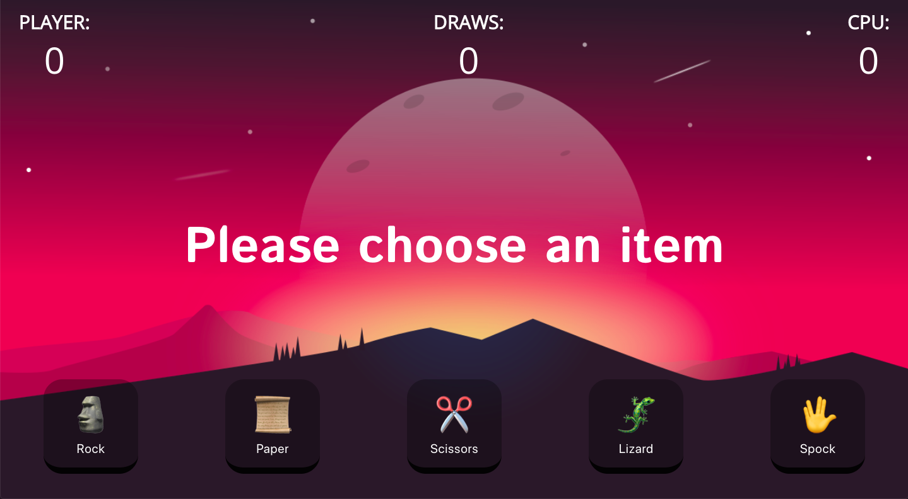

# Rock, Paper, Scissors, Lizard, Spock!
Demo: [https://netlify.rock-paper-scissors-lizard-spock.com](https://netlify.rock-paper-scissors-lizard-spock.com)

RPSLS is an extension to the original game of rock-paper-scissors. The additional characters were added by [Sam Kass and Karen Bryla](http://www.samkass.com/theories/RPSSL.html) before being adopted, reordered, and [overpopularised by The Big Bang Theory](http://bigbangtheory.wikia.com/wiki/Rock_Paper_Scissors_Lizard_Spock).

# Rules

The rules are simple: Scissors cuts paper. Paper covers rock. Rock crushes lizard. Lizard poisons Spock. Spock smashes scissors. Scissors decapitates lizard. Lizard eats paper. Paper disproves Spock. Spock vaporizes rock. Rock crushes scissors.

# Background
This is Day 5/100 of my #100DaysOfCode challenge on Twitter: [@andrewbdesign](https://twitter.com/andrewbdesign)

My focus was to build something for desktop. Haven't done any responsive designs to it. Feel free to Submit PRs. 
Note: I've used emojis for this build, so it may look different on your operating system.

# Background image credits
Found this background image from [here](https://swapnilrane24.itch.io/night-background-2)

# Local dev setup
In the project directory, you can run:

### `npm install`

This will install the necessary packages.

### `npm start`

Runs the app in the development mode. 
Open [http://localhost:3000](http://localhost:3000) to view it in the browser.

### `npm run build`

Builds the app for production to the `build` folder. 
